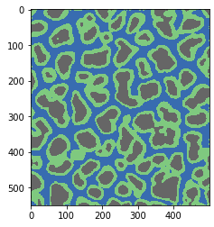
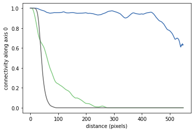
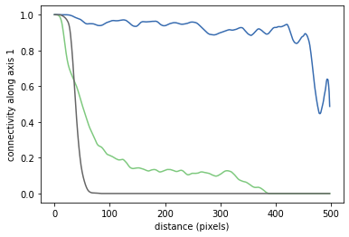

[](https://mps-toolbox.readthedocs.io/en/latest/?badge=latest)
[](https://circleci.com/gh/UniNE-CHYN/mps_toolbox)
[](https://github.com/UniNE-CHYN/mps_toolbox/actions/workflows/ci.yml)
[](https://codecov.io/gh/UniNE-CHYN/mps_toolbox)
[](https://badge.fury.io/py/mpstool)

# mpstool: Toolbox for Multiple-point statistics

This python3 project provides tools for computing quality indicators for multipoint statistics outputs.
The methods can also be applied to 2D or 3D images.

Currently the module provides :
- An Image class, with various import/export/conversion methods to different data types
- Functions for evaluating connectivity, histograms and variograms of 2D and 3D categorical images.

## Example: connectivity function
Connectivity function describes how different categories are connected depending on distance. It is given by: 

Load image and compute connectivity in different axes:
```
image = np.loadtxt('2D.txt').reshape(550, 500)
connectivity_axis0 = mpstool.connectivity.get_function(image, axis=0)
connectivity_axis1 = mpstool.connectivity.get_function(image, axis=1)
```

Example image of categorical soil cracks:



Corresponding connectivity functions:





## Installation
Install using pip. The package is in the PyPI:
`pip install mpstool`

If you want to run it directly from source, clone this repository and from the root folder run (useful for development):
` pip install -e .`

## Dependencies
- numpy
- py-vox-io
- scikit-image
- pillow
- properscoring

## Documentation

Can be found here: https://mps-toolbox.readthedocs.io/en/latest/index.html

