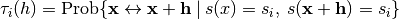
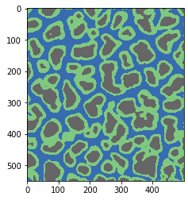
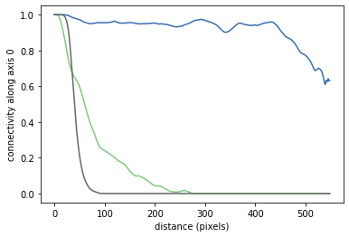
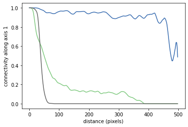

[](https://mps-toolbox.readthedocs.io/en/latest/?badge=latest)
[](https://circleci.com/gh/UniNE-CHYN/mps_toolbox)
[](https://github.com/UniNE-CHYN/mps_toolbox/actions/workflows/ci.yml)
[](https://codecov.io/gh/UniNE-CHYN/mps_toolbox)
[](https://badge.fury.io/py/mpstool)

# mpstool: Toolbox for Multiple-point statistics

This python3 project provides tools for computing quality indicators for multipoint statistics outputs.
The methods can also be applied to 2D or 3D images.

Currently the module provides :
- **An `Image` class** (`mpstool.img`) for handling 2D and 3D categorical or continuous grids, with:
  - Import/export to GSLIB, raw text, PNG, MagicaVoxel (`.vox`), VTK, PGM and PPM formats
  - Transformations: thresholding (continuous → categorical), automatic categorization (1D k-means), normalization, axis flips/permutations, and random sub-sampling
  - Visualization: 2D plots and 3D orthogonal cross-section cuts
- **Spatial statistics** (`mpstool.stats`): histograms (facies proportions) and indicator/continuous variograms, computed with a spatial-shift method
- **Connectivity analysis** (`mpstool.connectivity`): connectivity functions and maps describing how categories connect across distance, plus a threshold-based connectivity index (`gamma`) for continuous fields
- **FFT-accelerated variogram maps** (`mpstool.variogram`): full 2D variogram maps computed via FFT (Marcotte, 1996), which natively handle missing data (NaN) and are much faster than the spatial-shift method on large grids; includes a variogram-comparison metric for scoring simulation quality against a reference image
- **Cross-validation metrics** (`mpstool.cv_metrics`): probabilistic scoring rules (Brier score, CRPS, 0-1 score, linear score, and their class-balanced/skill-score variants) implementing the scikit-learn scorer interface, for cross-validating spatial simulators
- **Command-line tools** (`tools/`): `gslib-plot.py` for quickly visualizing a `.gslib` file, and `geone_cv.py` for cross-validating the `geone`/DeeSSe multi-point simulator via `GridSearchCV`, driven by a JSON configuration file

Note: `mpstool.variogram` and `mpstool.cv_metrics` are not imported automatically with `import mpstool` — import them explicitly if you need them.

## Example: connectivity function
Connectivity function describes how different categories are connected depending on distance. It is given by: 

Load image and compute connectivity in different axes:
```
image = np.loadtxt('2D.txt').reshape(550, 500)
connectivity_axis0 = mpstool.connectivity.get_function(image, axis=0)
connectivity_axis1 = mpstool.connectivity.get_function(image, axis=1)
```

Example image of categorical soil cracks:



Corresponding connectivity functions:





## Installation
Install using pip. The package is in the PyPI:
`pip install mpstool`

If you want to run it directly from source, clone this repository and from the root folder run (useful for development):
` pip install -e .`

## Dependencies
- numpy
- py-vox-io
- scikit-image
- pillow
- properscoring

## Documentation

Can be found here: https://mps-toolbox.readthedocs.io/en/latest/index.html

